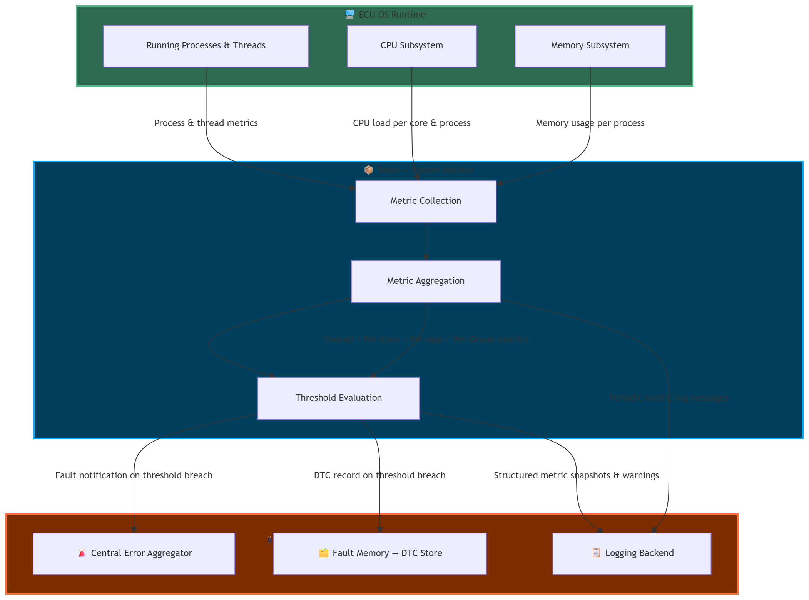

# DR-010-SMon: Introduce System Monitoring (SMon) middleware component for automotive ECUs

- **Date:** 2026-10-09

```{dec_rec} Introduce System Monitoring (SMon) middleware
:id: dec_rec__arch__introduce_smon_middleware
:status: proposed
:version: 1
:tracking:
:context: S-CORE lacks a common, portable, and configurable system monitoring component for observing CPU and memory resource usage on automotive ECUs across Linux and QNX. Applications currently have no standardized S-CORE mechanism for collecting system-, CPU-core-, process-, and application-level resource metrics and detecting configurable resource threshold violations.
:decision: Introduce System Monitoring (SMon) as an S-CORE middleware component that periodically collects CPU and memory metrics at system, CPU-core, process, and application level, evaluates configurable monitoring thresholds, and provides the collected monitoring information to S-CORE applications and external diagnostic or visualization tools through defined interfaces.
```

---

## Summary

This feature request proposes introducing **System Monitoring (SMon)** as a reusable
S-CORE middleware component for monitoring CPU and volatile memory
resource utilization on automotive ECUs running Linux or QNX.

SMon provides periodic resource measurements, configurable threshold
evaluation, and standardized integration interfaces for error
reporting, diagnostic fault recording, and logging.

## Detailed Feature Requirements

Detailed requirements are documented separately:

```{toctree}
:maxdepth: 1

DR-010-arch/README
```

---

## Context & Motivation

On a Domain Controller ECU, multiple applications share CPU and memory resources simultaneously.
There is currently no standardized S-CORE middleware component that:

- Periodically measures CPU and memory load at the **system, core, process, and
  application-group** level
- Evaluates those metrics against **configurable thresholds** and triggers fault reporting
  (error aggregator + DTC) or warning logs accordingly
- Operates portably across **Linux and QNX** via a clean platform abstraction boundary
- Exposes **well-defined required interfaces** for error reporting, DTC recording, and logging —
  fully decoupled from any specific backend implementation

Without such a component, each project team implements ad-hoc monitoring logic, leading to
fragmentation, inconsistency, and missed faults across vehicle programs.

---

## Requested Capabilities

### CPU Monitoring

- [ ] Overall system CPU load (as a percentage)
- [ ] CPU load per individual core
- [ ] CPU load per running application (process)
- [ ] CPU load per configured application group

### Memory

- [ ] Overall volatile memory load (as a percentage)
- [ ] Volatile memory load per running application (process)
- [ ] Volatile memory load per configured application group

### Threshold & Alerting

- [ ] Configurable threshold rules per metric type
- [ ] Configurable comparison operator per rule (e.g., greater than)
- [ ] Configurable actions per rule: `ReportError`, `RecordDTC`, `LogWarning`
- [ ] Configurable trigger mode per action: `Always` or `OnChange`
- [ ] Threshold rules scopeable to a specific application or application group

### Integration Interfaces

- [ ] Required interface for error reporting to the central error aggregator
- [ ] Required interface for DTC recording in the fault memory
- [ ] Required interface for log message publication

### Configuration

- [ ] All parameters readable from an external file (e.g., JSON) at startup — no recompilation
- [ ] Named application groups definable in configuration
- [ ] Logging enable/disable configurable per metric category
- [ ] Metrics logging interval configurable
- [ ] One or more threshold rules definable in configuration

### General & Platform

- [ ] Structured log messages published at the configured interval
- [ ] Graceful shutdown on `SIGINT` / `SIGTERM`
- [ ] Concurrent metric collection to minimize per-cycle latency
- [ ] Portable between Linux and QNX via a platform abstraction boundary
- [ ] Robust against processes or threads appearing/disappearing during an active scan

---

## Integration Context

The SMon component integrates with three **platform-provided services** via required interfaces:

| External Service             | Role                                                                 |
|------------------------------|----------------------------------------------------------------------|
| **Central Error Aggregator** | Receives fault notifications when configured thresholds are breached |
| **Fault Memory (DTC Store)** | Receives DTC records for persistent fault logging                    |
| **Logging Backend**          | Receives structured metric snapshots and threshold warning messages  |

> ⚠️ SMon does **not** mandate a specific implementation of any of these services.
> They are integration points to be fulfilled by the platform adopter.



---

## Anticipated Future Extensions

The following items are **out of scope** for this initial request but identified as natural
future extensions:

| Future Need                       | Description                                                                                           |
|-----------------------------------|-------------------------------------------------------------------------------------------------------|
| **Additional metric sources**     | Network I/O (SOME/IP, DDS), Disk I/O, GPU utilization                                                 |
| **Threshold hysteresis**          | Sustained-breach detection over N cycles + lower watermark for alert clearing                         |
| **Live telemetry streaming**      | Real-time metric streaming over a network transport to visualization tools or IDE dashboards          |
| **Cross-platform unit testing**   | Verifying platform-specific monitor logic on a Linux host via OS-call mocking (no QNX target needed)  |

---

## Stakeholders

| Role         | Party                                    |
|--------------|------------------------------------------|
| **Requester**| Valeo                                    |
| **Platforms**| Linux, QNX                               |
| **Domain**   | Platform Services / Health & Diagnostics |

---

## Acceptance Criteria

- [ ] All needs and requirements reviewed and accepted by the S-CORE community
- [ ] Required interface contracts (`IErrorReporter`, `IDTCRecorder`, `ILogger`) defined and
      agreed upon by the community
- [ ] Platform portability scope (Linux + QNX) acknowledged and accepted
- [ ] A follow-up implementation issue is created and linked to this request

---

## Related Links

- Feature request document: `docs/features/system_monitoring/README.rst`
- Context diagram: `docs/features/system_monitoring/assets/context_diagram.png`
- Requested by: Valeo
